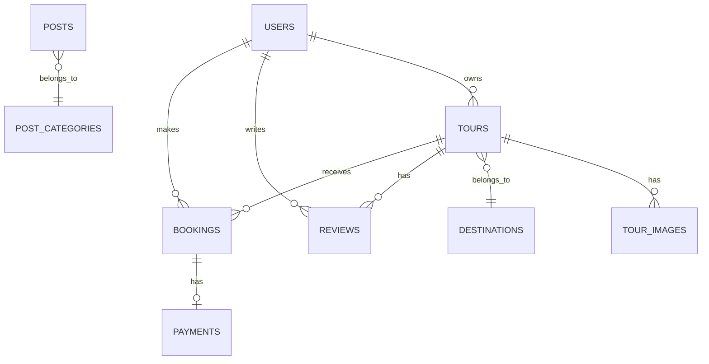

# Design Document

## Overview

The tour booking website will be built using Laravel 10+ with Blade templating engine, following MVC architecture patterns. The system will implement a multi-tenant approach supporting different user roles (travelers, admins, tour partners, guides) with role-based access control. The architecture emphasizes scalability, maintainability, and performance optimization for handling tour bookings, payments, and content management.

The application will use MySQL as the primary database, implement caching strategies with Redis, and integrate with Vietnamese payment gateways (VNPay, Momo). The frontend will be responsive using Bootstrap 5 with custom CSS, ensuring optimal user experience across desktop and mobile devices.

## Architecture

### System Architecture

```
┌─────────────────┐    ┌─────────────────┐    ┌─────────────────┐
│   Web Browser   │    │   Mobile App    │    │  Admin Panel    │
└─────────────────┘    └─────────────────┘    └─────────────────┘
         │                       │                       │
         └───────────────────────┼───────────────────────┘
                                 │
         ┌─────────────────────────────────────────────────┐
         │              Load Balancer                      │
         └─────────────────────────────────────────────────┘
                                 │
         ┌─────────────────────────────────────────────────┐
         │            Laravel Application                  │
         │  ┌─────────────┐  ┌─────────────┐  ┌──────────┐│
         │  │ Controllers │  │   Models    │  │  Views   ││
         │  └─────────────┘  └─────────────┘  └──────────┘│
         │  ┌─────────────┐  ┌─────────────┐  ┌──────────┐│
         │  │ Middleware  │  │  Services   │  │ Policies ││
         │  └─────────────┘  └─────────────┘  └──────────┘│
         └─────────────────────────────────────────────────┘
                                 │
         ┌─────────────────────────────────────────────────┐
         │              Data Layer                         │
         │  ┌─────────────┐  ┌─────────────┐  ┌──────────┐│
         │  │   MySQL     │  │    Redis    │  │ File     ││
         │  │  Database   │  │   Cache     │  │ Storage  ││
         │  └─────────────┘  └─────────────┘  └──────────┘│
         └─────────────────────────────────────────────────┘
                                 │
         ┌─────────────────────────────────────────────────┐
         │           External Services                     │
         │  ┌─────────────┐  ┌─────────────┐  ┌──────────┐│
         │  │   VNPay     │  │    Momo     │  │  Email   ││
         │  │  Gateway    │  │  Gateway    │  │ Service  ││
         │  └─────────────┘  └─────────────┘  └──────────┘│
         └─────────────────────────────────────────────────┘
```

### Application Structure

```
app/
├── Http/
│   ├── Controllers/
│   │   ├── Web/
│   │   │   ├── HomeController.php
│   │   │   ├── TourController.php
│   │   │   ├── BookingController.php
│   │   │   ├── PaymentController.php
│   │   │   └── UserController.php
│   │   └── Admin/
│   │       ├── DashboardController.php
│   │       ├── TourManagementController.php
│   │       ├── UserManagementController.php
│   │       └── BookingManagementController.php
│   ├── Middleware/
│   │   ├── RoleMiddleware.php
│   │   ├── BookingOwnerMiddleware.php
│   │   └── TourAvailabilityMiddleware.php
│   └── Requests/
│       ├── BookingRequest.php
│       ├── TourRequest.php
│       └── ReviewRequest.php
├── Models/
│   ├── User.php
│   ├── Tour.php
│   ├── Booking.php
│   ├── Payment.php
│   ├── Destination.php
│   ├── Review.php
│   └── Post.php
├── Services/
│   ├── BookingService.php
│   ├── PaymentService.php
│   ├── TourService.php
│   └── NotificationService.php
└── Policies/
    ├── TourPolicy.php
    ├── BookingPolicy.php
    └── UserPolicy.php
```

## Components and Interfaces

### Core Models and Relationships

#### User Model
```php
class User extends Authenticatable
{
    protected $fillable = [
        'name', 'email', 'phone', 'role', 'email_verified_at'
    ];
    
    public function bookings(): HasMany
    public function reviews(): HasMany
    public function tours(): HasMany // For tour partners
}
```

#### Tour Model
```php
class Tour extends Model
{
    protected $fillable = [
        'title', 'description', 'duration', 'price', 'max_participants',
        'destination_id', 'user_id', 'status', 'featured'
    ];
    
    public function destination(): BelongsTo
    public function bookings(): HasMany
    public function reviews(): HasMany
    public function images(): HasMany
    public function owner(): BelongsTo // Tour partner
}
```

#### Booking Model
```php
class Booking extends Model
{
    protected $fillable = [
        'user_id', 'tour_id', 'participants', 'tour_date',
        'total_amount', 'status', 'customer_info'
    ];
    
    public function user(): BelongsTo
    public function tour(): BelongsTo
    public function payment(): HasOne
}
```

### Service Layer Architecture

#### EmailVerificationService
```php
class EmailVerificationService
{
    public function sendVerificationEmail(User $user): bool
    public function verifyEmail(string $token): bool
    public function generateVerificationToken(User $user): string
    public function checkVerificationStatus(User $user): bool
    public function resendVerificationEmail(User $user): bool
}
```

#### BookingService
```php
class BookingService
{
    public function createBooking(array $data): Booking
    public function checkAvailability(Tour $tour, Carbon $date): bool
    public function calculateTotalAmount(Tour $tour, int $participants): float
    public function confirmBooking(Booking $booking): bool
    public function cancelBooking(Booking $booking): bool
}
```

#### PaymentService
```php
class PaymentService
{
    public function processVNPayPayment(Booking $booking): string
    public function processMomoPayment(Booking $booking): string
    public function handlePaymentCallback(array $data): bool
    public function recordPayment(Booking $booking, array $paymentData): Payment
}
```

### Controller Architecture

#### Web Controllers (Public Interface)
- **HomeController**: Handles homepage display with featured content
- **VerificationController**: Manages email verification process and resending verification emails
- **TourController**: Manages tour listing, filtering, and detail views
- **BookingController**: Processes booking flow and user booking management
- **PaymentController**: Handles payment processing and callbacks
- **UserController**: Manages user authentication and profile

#### Admin Controllers (Administrative Interface)
- **DashboardController**: Provides analytics and overview data
- **TourManagementController**: CRUD operations for tours
- **UserManagementController**: User account and role management
- **BookingManagementController**: Booking status and payment tracking

### Middleware Implementation

#### RoleMiddleware
```php
class RoleMiddleware
{
    public function handle(Request $request, Closure $next, string $role)
    {
        if (!auth()->check() || !auth()->user()->hasRole($role)) {
            abort(403);
        }
        return $next($request);
    }
}
```

#### EmailVerifiedMiddleware
```php
class EmailVerifiedMiddleware
{
    public function handle(Request $request, Closure $next)
    {
        if (!auth()->check() || !auth()->user()->hasVerifiedEmail()) {
            return redirect()->route('verification.notice');
        }
        return $next($request);
    }
}
```

## Data Models

### Database Schema Design

#### Core Tables Structure

**users**
- id (primary key)
- name (varchar)
- email (unique)
- phone (varchar)
- password (hashed)
- role (enum: user, admin, staff, partner, guide)
- email_verified_at (timestamp)
- created_at, updated_at

**email_verifications**
- id (primary key)
- user_id (foreign key)
- token (varchar, unique)
- expires_at (timestamp)
- created_at, updated_at

**tours**
- id (primary key)
- title (varchar)
- slug (unique)
- description (text)
- itinerary (json)
- duration (integer, days)
- price (decimal)
- max_participants (integer)
- destination_id (foreign key)
- user_id (foreign key, tour owner)
- status (enum: active, inactive, draft)
- featured (boolean)
- created_at, updated_at

**bookings**
- id (primary key)
- user_id (foreign key)
- tour_id (foreign key)
- participants (integer)
- tour_date (date)
- total_amount (decimal)
- status (enum: pending, confirmed, paid, completed, cancelled)
- customer_info (json)
- special_requests (text)
- created_at, updated_at

**payments**
- id (primary key)
- booking_id (foreign key)
- amount (decimal)
- payment_method (enum: vnpay, momo)
- transaction_id (varchar)
- status (enum: pending, completed, failed, refunded)
- gateway_response (json)
- processed_at (timestamp)
- created_at, updated_at

**destinations**
- id (primary key)
- name (varchar)
- slug (unique)
- description (text)
- location (varchar)
- coordinates (point)
- featured_image (varchar)
- created_at, updated_at

**reviews**
- id (primary key)
- user_id (foreign key)
- tour_id (foreign key)
- rating (integer, 1-5)
- comment (text)
- status (enum: pending, approved, rejected)
- created_at, updated_at

### Data Relationships



## Error Handling

### Exception Handling Strategy

#### Custom Exception Classes
```php
class BookingException extends Exception
{
    public static function tourNotAvailable(): self
    public static function insufficientSlots(): self
    public static function invalidDate(): self
}

class PaymentException extends Exception
{
    public static function gatewayError(string $message): self
    public static function transactionFailed(): self
}
```

#### Global Exception Handler
```php
class Handler extends ExceptionHandler
{
    public function render($request, Throwable $exception)
    {
        if ($exception instanceof BookingException) {
            return response()->view('errors.booking', [
                'message' => $exception->getMessage()
            ], 422);
        }
        
        if ($exception instanceof PaymentException) {
            return response()->view('errors.payment', [
                'message' => $exception->getMessage()
            ], 500);
        }
        
        return parent::render($request, $exception);
    }
}
```

### Validation and Input Handling

#### Form Request Validation
```php
class BookingRequest extends FormRequest
{
    public function rules(): array
    {
        return [
            'tour_id' => 'required|exists:tours,id',
            'participants' => 'required|integer|min:1|max:20',
            'tour_date' => 'required|date|after:today',
            'customer_info.name' => 'required|string|max:255',
            'customer_info.email' => 'required|email',
            'customer_info.phone' => 'required|string|max:20'
        ];
    }
    
    public function withValidator($validator)
    {
        $validator->after(function ($validator) {
            if (!$this->checkTourAvailability()) {
                $validator->errors()->add('tour_date', 'Tour not available on selected date');
            }
        });
    }
}
```

## Testing Strategy

### Testing Pyramid Implementation

#### Unit Tests
- **Model Tests**: Validate model relationships, scopes, and business logic
- **Service Tests**: Test business logic in service classes
- **Validation Tests**: Ensure form requests work correctly

#### Feature Tests
- **Authentication Flow**: Registration, login, password reset
- **Booking Process**: Complete booking workflow from selection to payment
- **Admin Functions**: Tour management, user management, analytics

#### Integration Tests
- **Payment Gateway Integration**: VNPay and Momo payment flows
- **Email Notifications**: Booking confirmations, password resets
- **Database Transactions**: Ensure data consistency during bookings

### Test Structure Example
```php
class BookingServiceTest extends TestCase
{
    use RefreshDatabase;
    
    public function test_can_create_booking_with_valid_data()
    {
        $user = User::factory()->create();
        $tour = Tour::factory()->create(['max_participants' => 10]);
        
        $booking = $this->bookingService->createBooking([
            'user_id' => $user->id,
            'tour_id' => $tour->id,
            'participants' => 2,
            'tour_date' => now()->addDays(7)
        ]);
        
        $this->assertInstanceOf(Booking::class, $booking);
        $this->assertEquals('pending', $booking->status);
    }
    
    public function test_cannot_book_tour_exceeding_capacity()
    {
        $tour = Tour::factory()->create(['max_participants' => 5]);
        
        $this->expectException(BookingException::class);
        
        $this->bookingService->createBooking([
            'tour_id' => $tour->id,
            'participants' => 6,
            'tour_date' => now()->addDays(7)
        ]);
    }
}
```

### Performance Testing
- **Load Testing**: Simulate concurrent booking requests
- **Database Performance**: Query optimization and indexing
- **Caching Effectiveness**: Redis cache hit rates and performance gains

### Security Testing
- **Authentication**: Test role-based access controls
- **Input Validation**: SQL injection and XSS prevention
- **Payment Security**: Secure handling of payment data